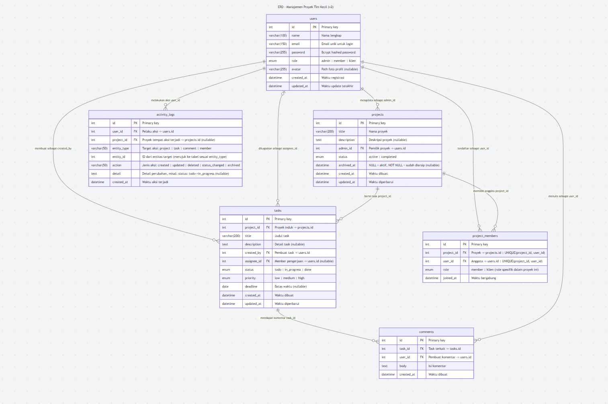

# Relasi Antar Tabel — ERD Manajemen Proyek Tim Kecil

---



## 1. `users` → `projects`

**One-to-Many** via `projects.admin_id`

Satu user (role admin) dapat memiliki dan mengelola banyak proyek. Setiap proyek wajib memiliki tepat satu admin sebagai penanggung jawab. Jika admin dihapus, perlu penanganan khusus (reassign atau cascade delete proyek).

---

## 2. `users` ↔ `projects` (via `project_members`)

**Many-to-Many** via tabel pivot `project_members`

Satu user dapat bergabung ke banyak proyek, dan satu proyek dapat memiliki banyak anggota. Tabel `project_members` menjadi jembatan sekaligus menyimpan `role` spesifik user *dalam proyek tersebut* (member atau klien), yang bisa berbeda dari role globalnya di tabel `users`. Constraint `UNIQUE(project_id, user_id)` memastikan satu user tidak bisa terdaftar dua kali dalam proyek yang sama.

---

## 3. `projects` → `tasks`

**One-to-Many** via `tasks.project_id`

Satu proyek dapat memiliki banyak task. Setiap task wajib berada di dalam satu proyek — task tidak bisa berdiri sendiri tanpa proyek induk. Jika proyek dihapus, seluruh task di dalamnya ikut terhapus (cascade delete).

---

## 4. `users` → `tasks` (sebagai pembuat)

**One-to-Many** via `tasks.created_by`

Satu user (biasanya Admin) dapat membuat banyak task. Kolom `created_by` bersifat NOT NULL — setiap task wajib tercatat siapa yang membuatnya dan tidak bisa null.

---

## 5. `users` → `tasks` (sebagai pengerjaan)

**One-to-Many** via `tasks.assignee_id`

Satu user (Member) dapat di-assign ke banyak task. Berbeda dengan `created_by`, kolom `assignee_id` bersifat nullable — task boleh belum di-assign ke siapapun saat pertama dibuat, dan bisa diisi belakangan oleh Admin.

---

## 6. `tasks` → `comments`

**One-to-Many** via `comments.task_id`

Satu task dapat memiliki banyak komentar. Komentar tidak bisa berdiri sendiri tanpa task induk. Jika task dihapus, seluruh komentar di dalamnya ikut terhapus (cascade delete).

---

## 7. `users` → `comments`

**One-to-Many** via `comments.user_id`

Satu user dapat menulis banyak komentar di berbagai task. Setiap komentar wajib tercatat pembuatnya — `user_id` bersifat NOT NULL.

---

## 8. `users` → `activity_logs`

**One-to-Many** via `activity_logs.user_id`

Satu user dapat menghasilkan banyak log aktivitas. Setiap entri log wajib mencatat siapa pelakunya — `user_id` NOT NULL. Contoh log yang dihasilkan:

```
user_id: 3 | project_id: 1 | entity_type: task | entity_id: 17
action: status_changed | detail: "status: todo -> in_progress"
```

---

## 9. `projects` → `activity_logs`

**One-to-Many** via `activity_logs.project_id`

Satu proyek dapat memiliki banyak entri log aktivitas. Kolom ini nullable — log yang bersifat global (misalnya aksi yang tidak terkait proyek manapun) tetap bisa disimpan dengan `project_id = NULL`. Kombinasi dengan `entity_type` + `entity_id` memungkinkan dua jenis query sekaligus: "tampilkan semua log di proyek X" (filter `project_id`) dan "tampilkan semua log yang menyentuh task Y" (filter `entity_type = 'task'` AND `entity_id = Y`).

---

## Ringkasan Kardinalitas

| Relasi | Tipe | Via Kolom |
|--------|------|----------|
| `users` → `projects` | One-to-Many | `projects.admin_id` |
| `users` ↔ `projects` | Many-to-Many | `project_members` (pivot) |
| `projects` → `tasks` | One-to-Many | `tasks.project_id` |
| `users` → `tasks` | One-to-Many | `tasks.created_by` |
| `users` → `tasks` | One-to-Many | `tasks.assignee_id` (nullable) |
| `tasks` → `comments` | One-to-Many | `comments.task_id` |
| `users` → `comments` | One-to-Many | `comments.user_id` |
| `users` → `activity_logs` | One-to-Many | `activity_logs.user_id` |
| `projects` → `activity_logs` | One-to-Many | `activity_logs.project_id` (nullable) |
